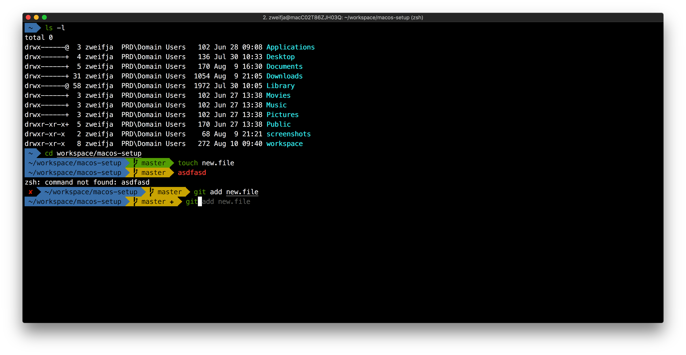

# Rockstar Shell 🎸

1. [Homebrew](https://brew.sh/)
   - Open Terminal
   - `$ /usr/bin/ruby -e "$(curl -fsSL https://raw.githubusercontent.com/Homebrew/install/master/install)"`
2. [iTerm2](https://www.iterm2.com/)
   - `$ brew cask install iterm2`
   - Close Terminal forever and open iterm2 😁
   - `⌘,` -> Appearance -> Theme, change it to `Dark` because cool devs use only dark themes 😎
   - Let's get even cooler, `⌘,` -> Profiles -> Colors -> Color Presets... and choose `Tango Dark`
   - Shortcuts
     - `⌘⇧D` split horizontally
     - `⌘D` split vertically
     - `⌘T` new tab
     - `⌘W` close currently focused terminal
     - `⌘[` / `⌘]` previous/next terminal
3. [zsh](http://zsh.sourceforge.net/)
   - `$ brew install zsh`
   - [oh my zsh](https://ohmyz.sh/)
     - `$ sh -c "$(curl -fsSL https://raw.github.com/robbyrussell/oh-my-zsh/master/tools/install.sh)"`
4. Upgrade your style
   - edit `~/.zshrc` and set `ZSH_THEME="agnoster"`, or [choose another theme](https://zshthem.es/)
   - While in your `~/.zshrc`, add the following: `export DEFAULT_USER=$(whoami)` -- this will hide the `user@hotname` portion in the prompt.
   - install [Meslo LG M Regular for Powerline](https://github.com/powerline/fonts/blob/master/Meslo%20Slashed/Meslo%20LG%20M%20Regular%20for%20Powerline.ttf)
   - Set the font in iTerm 2: `⌘,` -> Profiles -> Text -> Change Font, I prefer `Meslo LG M for Powerline`, 14pt
   - Just to make sure all the changes took effect, turn iTerm2 off and turn it on again
     
5. [zsh-autosuggestions](https://github.com/zsh-users/zsh-autosuggestions)
   - `brew install zsh-autosuggestions`
   - Add the following to your `.zshrc`: `source /usr/local/share/zsh-autosuggestions/zsh-autosuggestions.zsh`
6. [zsh-syntax-highlighting](https://github.com/zsh-users/zsh-syntax-highlighting)
   - `brew install zsh-syntax-highlighting`
   - Add `source /usr/local/share/zsh-syntax-highlighting/zsh-syntax-highlighting.zsh` to the end of your `~/.zshrc` file
7. Make it even cooler by adding a Quake-style drop down terminal.
   - `⌘,` -> Keys -> Create a Dedicated Hotkey Window...
   - I like to assign it to a double-tap of `^ Control`
   - Note that this will create a copy of your default profile specifically for the hotkey window. I like to increase the opacity of the window slightly:
     - ⌘,` -> Profiles -> Hotkey Window -> Window -> Opacity. It is a slider, so best to adjust this while the hotkey window is open!
7. Integrate your slick new shell into VS Code
   - Since you are a rockstar, you're likely using VS Code. Add the following to your preferences to make sure your new customizations look just as nice in the VS Code integrated terminal.
   1. Go to settings: `⌘,`
   2. Add `"terminal.integrated.shell.osx": "zsh",` to ensure we're using zsh
   3. Add `"terminal.integrated.fontFamily": "Meslo LG M for Powerline",` so we have the right font family
   4. Also add `"terminal.integrated.fontSize": 14,` to set the font size
8. Other tools
   - [TLDR pages](http://tldr.sh/)
     - Do you ever download a `tar.gz` and then immediately forget how to extract it? Some would tell you to read the man pages, I would say:
     
     Instead, use `tldr`! [TLDR pages](http://tldr.sh/) are simplified and community-driven man pages. Check it out!
     - Installation: `npm install -g tldr`
     - Usage: `tldr tar`, `tldr fly`, `tldr grep`
9. Resources for further customization:
   - https://gist.github.com/kevin-smets/8568070
   - https://code.tutsplus.com/tutorials/how-to-customize-your-command-prompt--net-24083
   - https://medium.com/@caulfieldOwen/youre-missing-out-on-a-better-mac-terminal-experience-d73647abf6d7
   - https://github.com/bhilburn/powerlevel9k/wiki/Show-Off-Your-Config

## Aliases

Any aliases can either go directly in `~/.zshrc` or in another file that is sourced in your `~/.zshrc`, example: `source ~/.zsh_aliases`

- Assuming a directory which contains only git repositories as subdirectories; perform a `git fetch -p` in all subdirectories: `alias fetchall="ls -d */ | xargs -P10 -t -I{} git -C {} fetch -p"`
